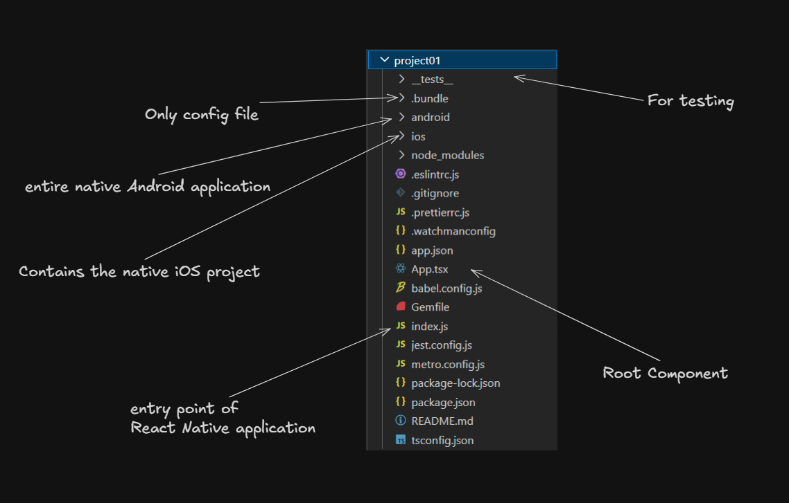
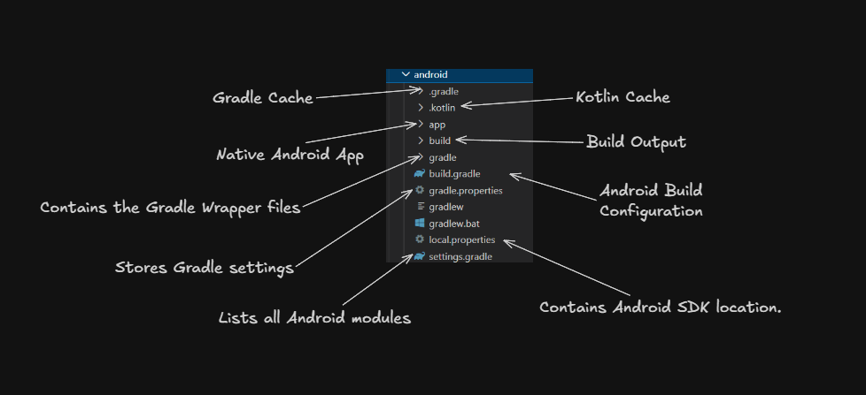
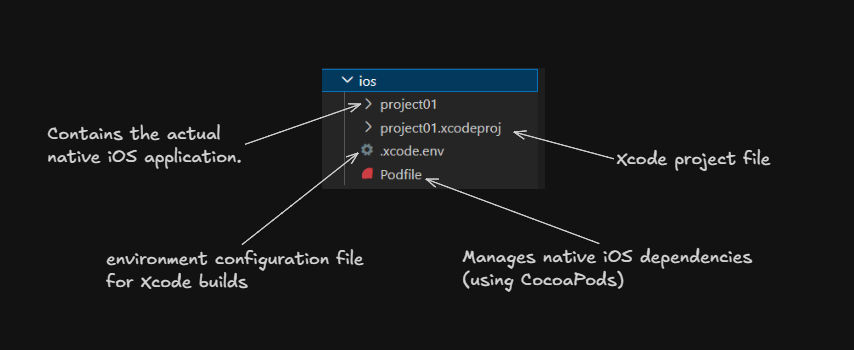

# Create react native 

## Using CLI 

``` npx @react-native-community/cli@latest init MyProject```

## Using Expo

``` npx create-expo-app@latest  ```


### Note :
- Expo is fast to set up and all but not ideal for production project


## File Structure

### 1. React native app using CLI file structure




