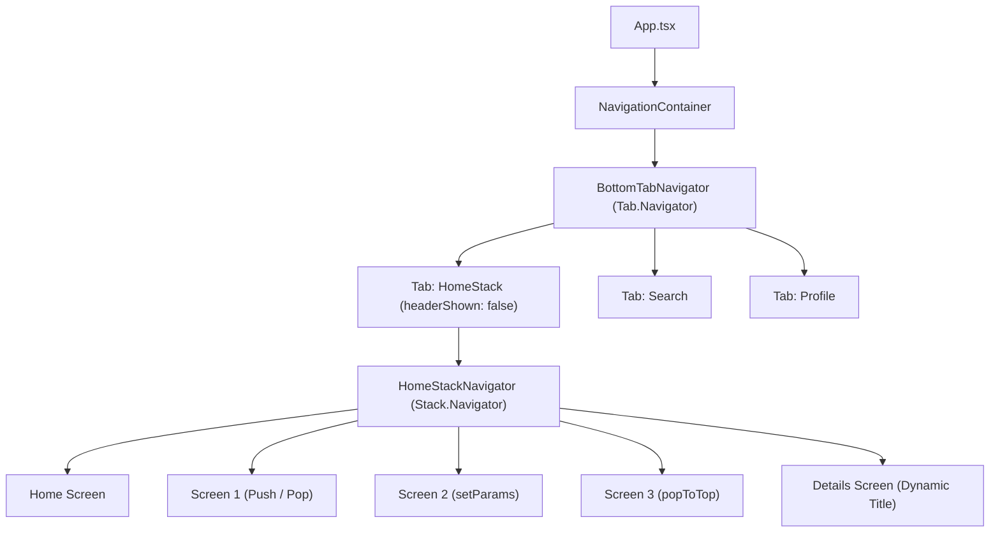

# React Native Navigation Learning 🚀

A comprehensive guide and reference built to understand **React Navigation v7** (Stack Navigators, Bottom Tab Navigators, Nested Navigators, Route Parameters, and Stack Operations).

---

## 📁 Project Structure (`navigation02`)

```text
navigation02/
├── App.tsx
└── src/
    ├── navigation/
    │   ├── types.ts                # TypeScript param definitions
    │   ├── BottomTabNavigator.tsx  # Root Bottom Tab Navigator
    │   └── HomeStackNavigator.tsx  # Nested Native Stack Navigator
    └── screens/
        ├── Home.tsx                # Main dashboard screen
        ├── Screen1.tsx             # Stack push & pop operations
        ├── Screen2.tsx             # Route params & setParams demo
        ├── Screen3.tsx             # Reset stack & tab switching
        ├── Details.tsx             # Dynamic route param rendering
        ├── Search.tsx              # Tab search screen
        └── Profile.tsx             # Profile screen & user info
```

---

## 📥 Packages Installed

```bash
# Core Navigation
npm install @react-navigation/native

# Native Stack Navigator
npm install @react-navigation/native-stack

# Bottom Tab Navigator
npm install @react-navigation/bottom-tabs

# Required Dependencies
npm install react-native-screens react-native-safe-area-context
```

---

## 🗺️ Routing Flow Diagrams

### 1. Overall Navigation Architecture (Nested Navigators)



---

### 2. Stack Navigation Flow & Actions

```mermaid
flowchart LR
    Home["Home Screen"] -->|navigate('Screen1')| S1["Screen 1"]
    S1 -->|push('Screen1')| S1Push["Screen 1 (Level +1)"]
    S1 -->|navigate('Screen2')| S2["Screen 2"]
    S2 -->|setParams()| S2Params["Screen 2 (Updated State)"]
    S2 -->|navigate('Screen3')| S3["Screen 3"]
    S3 -->|popToTop()| Home
    Home -->|navigate('Details', params)| Details["Details Screen"]
```

---

### 3. Cross-Navigator Flow (Stack to Tab)

```mermaid
flowchart TD
    Screen3["Screen 3 (Inside HomeStack)"] -->|navigation.navigate('Profile')| ProfileTab["Profile Tab"]
    Home["Home Screen"] -->|navigation.navigate('Search')| SearchTab["Search Tab"]
```

---

## 💡 Key Navigation Concepts Learned

### 1. Preventing Double Headers (Nested Navigators)
When nesting a `NativeStackNavigator` inside a `BottomTabNavigator`, both navigators display header bars by default. To hide the duplicate top header:

```tsx
// Inside BottomTabNavigator.tsx
<Tab.Screen
  name="HomeStack"
  component={HomeStackNavigator}
  options={{
    title: 'Home',
    headerShown: false, // 👈 Hides the Tab header so only the Stack header displays
  }}
/>
```

---

### 2. Navigation Methods Summary

| Method | Description | Code Example |
| :--- | :--- | :--- |
| `navigate` | Moves to a screen (reuses instance if active) | `navigation.navigate('Screen1')` |
| `push` | Pushes a NEW instance onto the stack stack | `navigation.push('Screen1')` |
| `goBack` | Pops the top screen off the stack | `navigation.goBack()` |
| `pop` | Pops `n` screens off the stack | `navigation.pop(2)` |
| `popToTop` | Resets stack back to the root screen | `navigation.popToTop()` |
| `setParams` | Updates parameters of the current screen | `navigation.setParams({ message: '...' })` |

---

### 3. Route Parameters (`route.params`)

#### Passing Parameters:
```tsx
navigation.navigate('Details', {
  itemId: 101,
  title: 'Product Details',
  description: 'Data passed via route params',
});
```

#### Receiving Parameters:
```tsx
export default function Details({ route }: Props) {
  const { itemId, title, description } = route.params;
  return <Text>{title}</Text>;
}
```

#### Dynamic Header Title from Params:
```tsx
<Stack.Screen
  name="Details"
  component={Details}
  options={({ route }) => ({
    title: route.params?.title || 'Details',
  })}
/>
```
